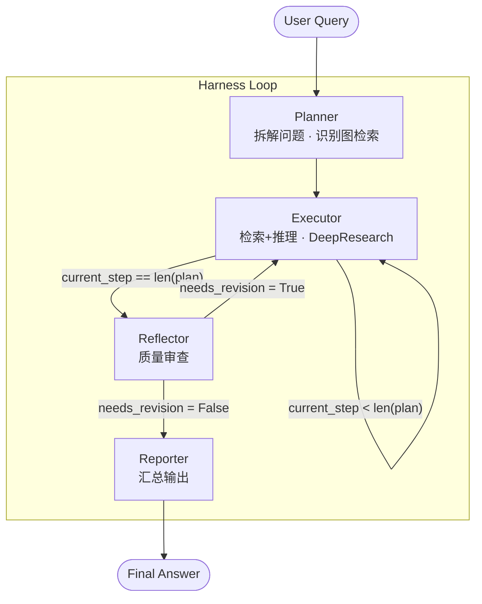
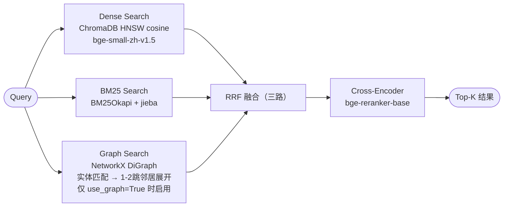

# Campus Agent

基于 LangGraph 的校园智能问答系统，采用**硬编码拓扑工作流**架构（Harness Loop），在 Plan-Execute-Reflect-Report 固定拓扑中集成 **GraphRAG** 混合检索能力。

## 架构

### Harness Loop 工作流拓扑

本系统是一个**硬编码拓扑工作流智能体**，而非多智能体系统。所有节点的调度逻辑、执行顺序与条件路由均在编译期静态确定，由 LangGraph Harness 驱动循环执行。各节点是工作流中具有特定职责的处理单元，而非自主决策的独立 Agent。



**固定拓扑路由规则：**

| 当前节点 | 条件 | 下一节点 |
|---------|------|---------|
| Planner | 无条件 | Executor |
| Executor | `current_step < len(plan)` | Executor（继续循环） |
| Executor | `current_step == len(plan)` | Reflector |
| Reflector | `needs_revision == True` | Executor（回退重做） |
| Reflector | `needs_revision == False` | Reporter |
| Reporter | 无条件 | END |

### 节点职责

- **Planner** — 将用户问题拆解为 2-5 个子步骤；通过关键词检测与 LLM 判断识别关系类问题，设置 `use_graph` 标志以调度图检索路径
- **Executor** — 逐步执行子步骤；调用三路混合检索，执行 DeepResearch（最多 3 轮迭代补充检索）；将图谱路径结构化信息注入 Prompt
- **Reflector** — 审查所有步骤结果的完整性与一致性；判定失败时将 `current_step` 回退至 0，触发 Harness 重新循环
- **Reporter** — 汇总各步骤结果，生成结构化 Markdown 回答，写入长期记忆

---

## GraphRAG 检索架构

在传统 Dense + BM25 双路检索基础上引入知识图谱（KG）召回，形成三路混合检索。




### 组件总览

| 组件 | 实现 |
|------|------|
| LLM | Ollama + Qwen2.5:7b（本地） |
| Embedding | BAAI/bge-small-zh-v1.5 |
| Reranker | BAAI/bge-reranker-base（Cross-Encoder） |
| 向量数据库 | ChromaDB（HNSW cosine） |
| 稀疏检索 | BM25Okapi + jieba |
| 知识图谱 | NetworkX DiGraph + LLM 批量三元组抽取 |
| 工作流引擎 | LangGraph（硬编码拓扑） |
| 记忆系统 | 短期（会���内 messages）+ 长期（JSON 持久化） |

---

## 快速开始

### 前置要求

- Python 3.10+
- [Ollama](https://ollama.com) 已安装并运行

```bash
ollama pull qwen2.5:7b
```

### 安装

```bash
git clone https://github.com/<your-username>/campus-agent.git
cd campus-agent
pip install -r requirements.txt
```

### 配置

编辑 `.env`（关键参数）：

```env
OLLAMA_MODEL=qwen2.5:7b
OLLAMA_BASE_URL=http://localhost:11434
EMBEDDING_MODEL=BAAI/bge-small-zh-v1.5
RERANKER_MODEL=BAAI/bge-reranker-base
KG_INDEX_PATH=./index/kg_graph.pkl
```

### 运行

```bash
# 将文档放入 data/ 目录（支持 PDF、Markdown）
python main.py

# 强制重建全部索引（含知识图谱，耗时较长）
python main.py --reindex
```

> **首次运行说明**：`index_documents` 会自动触发知识图谱构建，每批 5 个文档块调用一次 LLM 抽取三元组。后续启动直接从 `index/kg_graph.pkl` 加载，无额外开销。

---

## 项目结构

```
campus-agent/
├── main.py                  # 入口：建索引 → 编译拓扑图 → 交互循环
├── src/
│   ├── graph.py             # AgentState 定义 + 硬编码拓扑路由
│   ├── agents/
│   │   ├── planner.py       # 问题拆解 + 关系类问题识别（use_graph）
│   │   ├── executor.py      # 子步骤执行 + DeepResearch + 图谱上下文整合
│   │   ├── reflector.py     # 质量审查与回退控制
│   │   └── reporter.py      # 汇总输出 + 长期记忆写入
│   └── utils/
│       ├── retriever.py     # Dense + BM25 + Graph 三路检索 + RRF + Reranker
│       ├── loader.py        # PDF/Markdown 解析、分块、LLM 三元组抽取、KG 构建
│       └── memory.py        # 长期/短期记忆管理
├── data/                    # 原始文档目录
├── index/                   # 持久化索引
│   ├── chroma.sqlite3       # ChromaDB 元数据
│   ├── bm25_index.pkl       # BM25 稀疏索引
│   ├── kg_graph.pkl         # NetworkX 知识图谱
│   └── long_term_memory.json
└── requirements.txt
```

## LangGraph 状态字段

```python
class AgentState(TypedDict):
    query: str                  # 用户原始问题
    plan: list[str]             # Planner 拆解的子步骤
    current_step: int           # Harness 当前执行位置
    steps_results: list[dict]   # 各步骤执行结果
    sources: list[dict]         # 检索到的所有文档证据
    short_term_memory: list[str]# 会话内上下文（add_messages 累积）
    long_term_memory: dict      # 跨会话持久化知识
    response: str               # 最终回答
    needs_revision: bool        # Reflector 回退信号
    # ── GraphRAG 扩展 ──
    use_graph: bool             # 是否启用图检索路径
    graph_context: list[dict]   # 图路径召回的结构化上下文
    kg_entities: list[str]      # 识别出的关键实体
```

