# campus-agent 完整流程图

```mermaid
flowchart TD
    %% ── 启动阶段 ──────────────────────────────────────────
    subgraph STARTUP["main.py — 启动阶段"]
        A1([python main.py]) --> A2["load_dotenv()\n读取 .env 配置"]
        A2 --> A3["loader.py\nload_directory('./data')\n解析 PDF / Markdown"]
        A3 --> A4["retriever.py — index_documents()\n① embed_documents  BGE-small-zh\n② ChromaDB.upsert  向量索引\n③ _build_bm25_index  jieba + BM25Okapi\n④ 持久化 bm25_index.pkl"]
        A4 --> A5["graph.py — build_graph()\n编译 LangGraph 状态机"]
        A5 --> A6[/"用户输入 query"/]
    end

    %% ── 初始状态 ──────────────────────────────────────────
    A6 --> INIT

    subgraph INIT["AgentState 初始化  (graph.py — AgentState)"]
        direction LR
        I1["query         = 用户问题
plan          = []
current_step  = 0
steps_results = []
sources       = []
short_term_memory = []
long_term_memory  = {}
response          = ''
needs_revision    = False"]
    end

    INIT -->|"graph.invoke(initial_state)"| PLANNER

    %% ── Planner ───────────────────────────────────────────
    subgraph PLANNER["planner.py — Planner Node"]
        P1["memory.py\nload_long_term_memory()\n读 long_term_memory.json"] --> P2
        P2["ChatOllama  qwen2.5:7b  temp=0\nPrompt: 将 query 拆解为 2-5 个子步骤\n→ 输出 JSON 数组"] --> P3
        P3["State 写入\n  plan          ← ['步骤1', '步骤2', ...]\n  current_step  ← 0\n  steps_results ← []\n  sources       ← []\n  short_term_memory += ['用户问题: ...']"]
    end

    PLANNER -->|"add_edge (固定边)"| EXECUTOR

    %% ── Executor ──────────────────────────────────────────
    subgraph EXECUTOR["executor.py — Executor Node"]
        E1["step = plan[current_step]"] --> RETRIEVE

        subgraph RETRIEVE["retriever.py — retrieve_documents(step, top_k=5)"]
            RD["_dense_search()\n① _get_embeddings()  BGE-small-zh (CPU)\n② embed_query(step)\n③ ChromaDB.query  cosine HNSW\n→ top 20 候选"]
            RB["_bm25_search()\n① _load_bm25_index()  读 pkl\n② jieba.cut(step)\n③ BM25Okapi.get_scores()\n→ top 20 候选"]
            RR["reciprocal_rank_fusion()\nRRF(d) = Σ 1 / (60 + rank)\n两路合并去重"]
            RC["_rerank()\n① _get_reranker()  BGE-reranker-base\n② CrossEncoder.predict(pairs)\n→ 排序取 top 5"]
            RD --> RR
            RB --> RR
            RR --> RC
        end

        RC --> DEEP

        subgraph DEEP["_deep_research()  最多 MAX_DEEP_RESEARCH_ROUNDS=3 轮"]
            D1["拼接 docs → retrieved_docs\n调用 EXECUTOR_PROMPT"] --> D2
            D2["ChatOllama  qwen2.5:7b  temp=0\n回答当前子步骤"] --> D3
            D3{"response 含\n'证据不足' 或\n'无法确定'?"}
            D3 -->|"Yes — 追加检索\nretrieve_documents('补充: step+回答前100字', top_k=3)\nall_docs.extend(followup_docs)"| D1
            D3 -->|No — 证据充足| D4["返回 result + sources + evidence_chain"]
        end

        D4 --> EU["State 写入\n  steps_results += {step, result, evidence_chain}\n  sources       += docs\n  current_step  += 1\n  short_term_memory += ['步骤N完成: ...']"]
    end

    EU --> ECOND{"graph.py\nshould_continue_execution()\ncurrent_step < len(plan)?"}
    ECOND -->|"Yes → 继续执行下一步"| EXECUTOR
    ECOND -->|"No  → 所有步骤完成"| REFLECTOR

    %% ── Reflector ─────────────────────────────────────────
    subgraph REFLECTOR["reflector.py — Reflector Node"]
        RF1["汇总所有 steps_results 为文本"] --> RF2
        RF2["ChatOllama  qwen2.5:7b  temp=0\nPrompt: 审查完整性 / 矛盾 / 证据链\n→ 输出 JSON\n  {needs_revision, reason, revision_hints}"] --> RF3
        RF3["State 写入\n  needs_revision ← true / false\n  short_term_memory += ['Reflector审查: ...']"]
        RF3 --> RF4{"needs_revision=True?\n回退重做"}
        RF4 -->|"True:\n  current_step  ← 0\n  steps_results ← []"| REFLECTOR_RESET
        RF4 -->|False| REPORTER
    end

    REFLECTOR_RESET["重置后重入 Executor"] --> EXECUTOR

    %% ── Reporter ──────────────────────────────────────────
    subgraph REPORTER["reporter.py — Reporter Node"]
        RP1["去重 sources (按 source_file + page)\n取前10条"] --> RP2
        RP2["ChatOllama  qwen2.5:7b  temp=0.3\nPrompt: 汇总所有步骤结果\n→ 生成结构化 Markdown 回答"] --> RP3
        RP3["memory.py\nsave_long_term_memory(query, answer)\n写入 long_term_memory.json\n(最多保留100条)"] --> RP4
        RP4["State 写入\n  response ← 最终 Markdown 回答\n  short_term_memory += ['最终回答已生成']"]
    end

    REPORTER -->|"add_edge → END"| OUTPUT
    OUTPUT[/"打印 response\n引用来源数 / 执行步骤数\n返回 input 循环"/] --> A6

    %% ── 持久化层 ──────────────────────────────────────────
    subgraph STORAGE["持久化文件层"]
        F1["./data/\nMSc_Student_Handbook.pdf 等原始文档"]
        F2["./index/chroma.sqlite3\n+ HNSW bin 文件\n(向量索引)"]
        F3["./index/bm25_index.pkl\nBM25Okapi 序列化 + corpus_meta"]
        F4["./index/long_term_memory.json\n{query: answer}  跨会话记忆"]
    end

    A3 -.读取.-> F1
    A4 -.写入.-> F2
    A4 -.写入.-> F3
    RD -.查询.-> F2
    RB -.查询.-> F3
    P1 -.读取.-> F4
    RP3 -.写入.-> F4
```

---

## 各 .py 职责速查

| 文件 | 职责 |
|------|------|
| `main.py` | 启动入口，建索引，编译图，交互循环 |
| `src/graph.py` | 定义 `AgentState`，编排四个节点，条件路由 |
| `src/agents/planner.py` | 调 LLM 把 query 拆成子步骤列表 |
| `src/agents/executor.py` | 逐步检索 + DeepResearch 回答每个子步骤 |
| `src/agents/reflector.py` | 审查所有步骤结果，决定是否回退重做 |
| `src/agents/reporter.py` | 汇总生成最终回答，写入长期记忆 |
| `src/utils/retriever.py` | Dense + BM25 + RRF + CrossEncoder 混合检索 |
| `src/utils/memory.py` | 长期记忆读写（JSON），短期记忆截断工具 |
| `src/utils/loader.py` | PDF / Markdown 解析，分块切片 |
